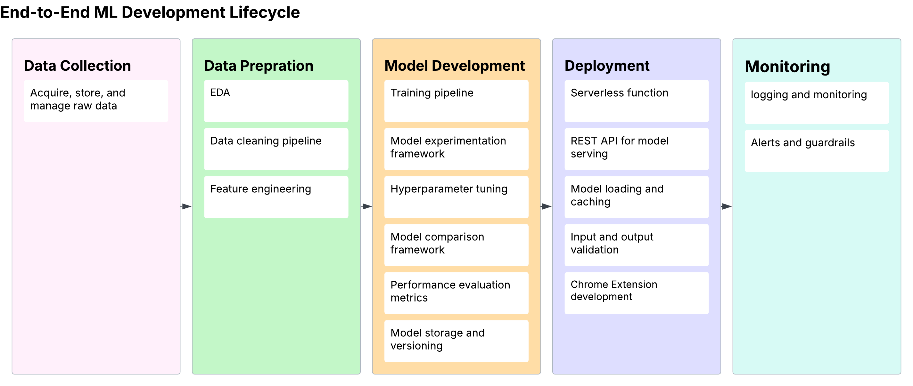
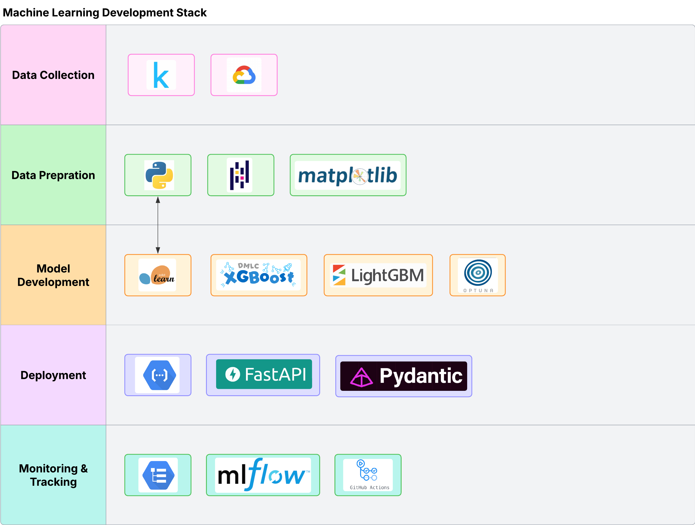

# Deal IQ - Intelligence for used car deals 🚗💡

A Chrome extension that predicts car deal quality on marketplace websites using machine learning. This project demonstrates end-to-end ML engineering capabilities including planning, building, and deploying ML projects.

## 🎯 Project Overview

Deal IQ analyzes used car listings on popular marketplace websites and provides instant deal quality predictions, helping users identify great deals and avoid overpriced vehicles.

### Key Value Propositions
- **Real-time Analysis**: Instant predictions on live marketplace listings
- **Data-Driven Insights**: ML model trained on 400K+ vehicle listings
- **Cost-Effective**: Serverless deployment keeping operational costs <$10/month
- **Scalable Architecture**: Cloud-native design ready for high traffic

## ✨ Features

### 🎯 Deal Classification System

The extension categorizes deals into four distinct categories:

| Category | Criteria | Description |
|----------|----------|-------------|
| 🟢 **Great Deal** | 20%+ below fair price | Exceptional value, act fast! |
| 🔵 **Good Deal** | 10-20% below fair price | Solid deal worth considering |
| 🟡 **Fair Deal** | ±10% of fair price | Market-rate pricing |
| 🔴 **Overpriced** | 10%+ above fair price | Above market value |

### 📊 Output Information

For each analyzed listing, Deal IQ provides:
- **Deal Classification Label** with color coding
- **Confidence Score** (0-100%)
- **Percentage Difference** from estimated market value
- **Estimated Fair Price** based on ML model prediction

## 🌐 Supported Platforms

### Primary Targets
- **Facebook Marketplace** - Meta's vehicle marketplace
- **Clutch** - Canadian automotive marketplace

### Scope
- **Vehicle Type**: Used cars only
- **Geographic Coverage**: USA-based listings
- **Training Data**: 2017-2022 vehicle listings (1.5GB dataset → 800MB processed)

## 🔧 Technical Features

### Machine Learning Model Features

#### Core Features (Primary Predictors)
- **Price** - Listed vehicle price
- **Year** - Manufacturing year
- **Manufacturer** - Vehicle brand
- **Model** - Specific vehicle model
- **Odometer** - Mileage reading
- **Condition** - Vehicle condition rating

#### Secondary Features
- **Cylinders** - Engine cylinder count
- **Fuel Type** - Gasoline, diesel, hybrid, electric
- **Title Status** - Clean, salvage, rebuilt, etc.
- **Transmission** - Manual, automatic, CVT
- **Drive Type** - FWD, RWD, AWD, 4WD
- **Vehicle Size** - Compact, mid-size, full-size
- **Vehicle Type** - Sedan, SUV, truck, coupe

#### Location Features
- **Region** - Geographic region
- **State** - US state
- **Coordinates** - Latitude and longitude
- **Paint Color** - Vehicle exterior color
- **Description** - Text analysis of listing description

### Model Performance Targets
- **Primary Metric**: RMSE < $2,500
- **Secondary Metrics**: MAE, R² Score, MAPE
- **Inference Time**: < 200ms per prediction
- **Model Size**: Optimized for serverless cold starts

## 🏗️ Infrastructure & Deployment

*Complete ML development lifecycle from data collection to monitoring*

The project follows a comprehensive ML pipeline architecture with five main stages:
- **Data Collection & Storage**: Raw data acquisition and versioning
- **Data Preparation**: Cleaning, feature engineering, and validation
- **Model Development**: Training multiple algorithms and hyperparameter tuning
- **Deployment**: Serverless model serving via Google Cloud Run
- **Monitoring**: Performance tracking and model maintenance

## 🛠️ Technology Stack

*Python-based data science and ML technology ecosystem*

### Core Technologies
- **Backend**: Python 3.11+, FastAPI for REST API
- **ML Libraries**: scikit-learn, XGBoost, LightGBM for traditional ML
- **Data Processing**: pandas, NumPy for data manipulation
- **Visualization**: matplotlib, seaborn for EDA and insights
- **Deployment**: Google Cloud Run (serverless), Docker containers
- **Storage**: Google Cloud Storage for data and model artifacts
- **Monitoring**: MLflow for experiment tracking and model versioning

## 🎮 User Experience

### Current Implementation
- **Activation Method**: Manual trigger via button click
- **Display Format**: Overlay or popup on listing page
- **Information Display**: 
  - Deal category badge
  - Fair price estimate
  - Percentage variance from market value
  - Confidence indicator

### Future Enhancements
- **Automatic Activation**: Auto-trigger after API stability testing
- **Batch Analysis**: Analyze multiple listings simultaneously
- **Price Alerts**: Notify when great deals appear
- **Historical Tracking**: Track price changes over time

## 📊 Project Phases

### Phase 1: Foundation & Planning ✅
- System architecture design
- Technology stack selection
- Infrastructure planning
- Cost optimization analysis

### Phase 2: Data Processing & EDA 🔄 (Current)
- Data cleaning and validation pipeline
- Exploratory data analysis and insights
- Feature engineering and selection
- Data quality assessment

### Phase 3: Model Development (Upcoming)
- Algorithm experimentation (scikit-learn, XGBoost, LightGBM)
- Hyperparameter tuning and optimization
- Model evaluation and selection
- Performance benchmarking

### Phase 4: Deployment & API
- FastAPI REST API development
- Google Cloud Run deployment
- Model serving optimization
- API documentation and testing

### Phase 5: Chrome Extension
- Extension architecture and UI design
- Marketplace website integration
- Real-time data extraction
- User experience optimization

